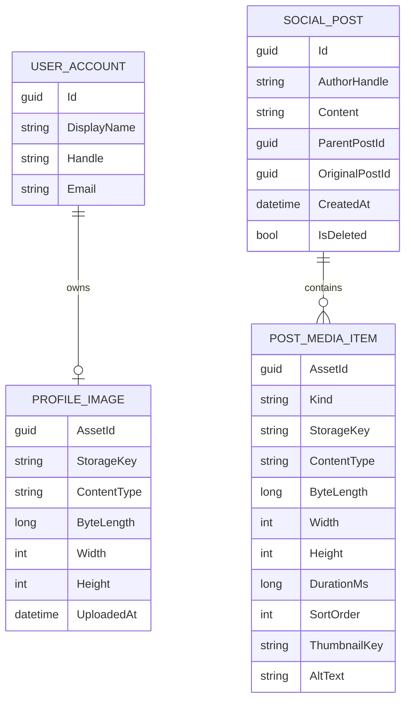
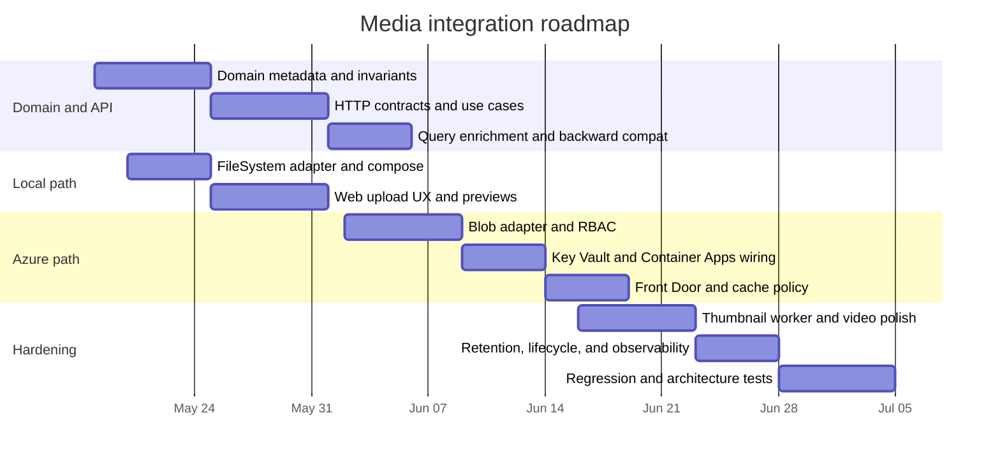

# Clean Architecture Media Integration for clean-architecture-csharp

## Executive summary

The repository is already enforcing a **component-first Clean Architecture**: `SocialApp.User` and `SocialApp.Post` own their own entities, request/response models, controllers, interactors, presenters, and gateway interfaces; business components are forbidden from referencing outer details or each other; infrastructure references business components, while the Blazor web app does not. The repo’s own “add a new use case” guide also explicitly says to put behavior in the owning component, avoid a shared application layer, and avoid generic `IRepository<T>` abstractions. That means the cleanest media design is **not** a new shared `Media` core. Instead, profile-image behavior should stay inside `SocialApp.User`, post-attachment behavior should stay inside `SocialApp.Post`, and storage should be implemented as outer adapters behind component-owned ports. fileciteturn8file0L3-L3 fileciteturn42file0L3-L3 fileciteturn62file0L3-L3

Today, the domain model has **no media metadata at all**: `UserAccount` contains only identity/profile/auth fields, `SocialPost` contains text, parent/original-post relationships, likes, and deletion state, the HTTP contract for creating posts accepts only `content`, and the persistence layer mirrors that minimal shape in `UserDocument` and `PostDocument`. The API composes use cases directly in minimal endpoints, falls back to in-memory gateways when Cosmos/Azure services are absent, Docker Compose currently runs only API, Web, and Mongo, and Terraform currently provisions Cosmos DB Mongo API, Communication Services, Container Apps, and Static Web Apps. Media therefore needs to be added end-to-end: domain metadata, API contracts, storage adapters, document mappings, test coverage, Docker Compose changes, and Terraform additions. fileciteturn20file0L3-L3 fileciteturn22file0L3-L3 fileciteturn29file0L3-L3 fileciteturn35file0L3-L3 fileciteturn36file0L3-L3 fileciteturn17file0L3-L3 fileciteturn13file0L3-L3 fileciteturn58file0L3-L3

For Azure, the strongest fit is **Azure Blob Storage for binary media**, **Azure Front Door Standard or Premium for global delivery and caching**, **managed identity + Microsoft Entra authorization + user delegation SAS for upload/read delegation**, and **Key Vault references for secrets that must still exist**. Use **Azure Files only if the app truly needs a mounted shared filesystem inside Container Apps**; Container Apps supports Azure Files mounts as permanent storage, but not Blob as a filesystem mount. **Azure Media Services should not be used for new design** because it was retired on June 30, 2024; Microsoft’s own retirement guidance points customers to partners for streaming/protection workflows and to Azure Video Indexer only for analysis workloads. citeturn0search4turn7search6turn7search2turn1search0turn1search1turn8search0turn11search2turn12search2turn4view0

The highest-leverage implementation approach is a **two-phase upload flow**: first request an upload session from the API, then upload directly to object storage with a short-lived SAS, then finalize/attach the uploaded asset to `UserAccount` or `SocialPost`. That keeps the domain pure, keeps the API stateless and light, avoids pushing large binaries through the app container, and aligns with Azure Blob Storage’s documented SDK, Entra auth, and user delegation SAS model. It also lets local development run either against a simple filesystem adapter mounted by Docker Compose or against a MinIO-based S3-compatible adapter without changing the business-layer contracts. citeturn10view0turn9search0turn13search1turn13search3

## Current repo map

The repository is functionally layered, but the layering is expressed **inside components** rather than as one central domain/application/infrastructure stack. The map below reflects the current repo structure, endpoint composition, infrastructure registration, architecture rules, the current Docker Compose file, and the current Terraform deployment. fileciteturn8file0L3-L3 fileciteturn17file0L3-L3 fileciteturn19file0L3-L3 fileciteturn41file0L3-L3 fileciteturn42file0L3-L3 fileciteturn13file0L3-L3 fileciteturn58file0L3-L3

| Layer | Current repo shape | What it does today | Where media should live |
|---|---|---|---|
| Domain | `src/SocialApp.User/Entities`, `src/SocialApp.Post/Entities` | Pure entities and invariants such as password rules, post content rules, like/delete/repost behavior | **Media metadata only**, never bytes. Add `ProfileImage` to `UserAccount`; add `PostMediaItem` collection to `SocialPost` |
| Application | `RequestModels`, `UseCases`, `Controllers`, `Presenters`, `ResponseModels` inside each component | Use-case orchestration and translation between boundaries | Add upload-session, finalize, remove, and enriched query responses inside the **owning component** |
| Infrastructure | `src/SocialApp.Infrastructure.CosmosMongo`, `src/SocialApp.Infrastructure.AcsEmail` | Outer adapters for persistence and email; DI wires interfaces to implementations | Add storage adapters: filesystem for local, Azure Blob for cloud, optional MinIO/S3-compatible for local object-store rehearsal |
| API composition | `src/SocialApp.Api/Contracts`, `src/SocialApp.Api/Endpoints` | Minimal HTTP surface assembling controllers/interactors | Add media endpoints/contracts, but keep business rules in existing components |
| Web/UI | `src/SocialApp.Web` | HTTP client + Blazor pages for feed/profile/auth | Add upload UX, progress, thumbnail/video rendering, profile-image picker |
| Deployment | `docker-compose.yml`, `infra/terraform` | Local Mongo + app containers; Azure Cosmos/Container Apps/SWA/ACS | Add media volume or MinIO locally; add Blob, Front Door, Key Vault, and RBAC in Azure |

The critical architectural point is that **media is not one business capability here**. “Change profile image” belongs to `SocialApp.User`; “attach images/video to a post” belongs to `SocialApp.Post`; “store bytes and issue URLs” belongs to infrastructure. That distribution is what preserves the repo’s current architectural rules instead of weakening them. fileciteturn62file0L3-L3 fileciteturn42file0L3-L3

## Proposed domain and API design

### Domain model changes

The current domain forces every post to have non-empty text and has no media concept, so media support requires a deliberate invariant change: a post should become valid when it has **text or at least one attachment**, not only text. `UserAccount` also needs an optional profile-image value object. Persist only metadata and storage references in the aggregates; the binary object itself stays outside the domain. fileciteturn20file0L3-L3 fileciteturn22file0L3-L3

Recommended aggregate/value-object shape:

- `UserAccount` aggregate root
  - add `ProfileImage? ProfileImage`
  - behavior: `SetProfileImage(...)`, `RemoveProfileImage()`
- `SocialPost` aggregate root
  - add private list of `PostMediaItem`
  - behavior: `AttachMedia(...)`, `RemoveMedia(...)` if drafts are supported before publish
  - invariant: text-or-media required; configurable count/type limits
- `ProfileImage` value object
  - `AssetId`, `StorageKey`, `ContentType`, `ByteLength`, `Width`, `Height`, `UploadedAt`
- `PostMediaItem` value object
  - `AssetId`, `Kind` (`Image` or `Video`), `StorageKey`, `ContentType`, `ByteLength`, `Width`, `Height`, `DurationMs`, `SortOrder`, `ThumbnailKey`, `AltText`
- optional `MediaConstraints` policy object
  - default starting rule: up to **4 images** or **1 video** in v1, while allowing the rule to be configuration-driven



This ER diagram is a **domain metadata model**, not a storage-schema prescription. In the repo’s style, `PROFILE_IMAGE` and `POST_MEDIA_ITEM` are best implemented as value objects embedded in the owning aggregate rather than as independent business aggregates. That matches the current entity style and the repo’s explicit guidance to keep each use case in the owning component and add missing gateway capabilities to that component instead of introducing a shared repository core. fileciteturn20file0L3-L3 fileciteturn22file0L3-L3 fileciteturn52file0L3-L3 fileciteturn62file0L3-L3

### Use-case and DTO changes

Current endpoints expose account creation, sessions, viewing a user, creating/deleting/liking/reposting/searching posts, and recent-feed queries. The media-enabled API should extend that surface, not replace it. Existing clients should continue to work if new fields are optional and old request bodies remain valid. fileciteturn19file0L3-L3 fileciteturn29file0L3-L3 fileciteturn32file0L3-L3 fileciteturn44file0L3-L3

| Proposed use case | HTTP shape | Owning component | Purpose | Key validation |
|---|---|---|---|---|
| Begin profile image upload | `POST /api/users/me/profile-image/upload-sessions` | `SocialApp.User` | Reserve asset id and return upload instruction | Image only; allowed content types; max bytes; authenticated user only |
| Complete profile image upload | `POST /api/users/me/profile-image/complete` | `SocialApp.User` | Persist metadata after upload succeeds | Blob/object must exist; dimensions/content type must match policy |
| Remove profile image | `DELETE /api/users/me/profile-image` | `SocialApp.User` | Detach image and optionally delete blob asynchronously | Ownership/auth required |
| Begin post media upload | `POST /api/posts/media/upload-sessions` | `SocialApp.Post` | Reserve one or more media uploads | Per-item count/type/size rules |
| Complete post media upload | `POST /api/posts/media/{assetId}/complete` | `SocialApp.Post` | Mark draft asset usable for posting | Blob/object existence; checksum or content type match |
| Create post with media | existing `POST /api/posts` plus `mediaAssetIds` | `SocialApp.Post` | Publish post with attachments | Require text or media; max 4 images or 1 video in starter policy |
| View user | existing `GET /api/users/{handle}` enriched | `SocialApp.User` | Return display info plus profile image URL/metadata | None beyond current handle lookup |
| Recent/search posts | existing queries enriched | `SocialApp.Post` | Return media URLs, thumbnails, dimensions, duration | Empty list when no media |

A practical HTTP contract shape for v1:

```csharp
public sealed record CreatePostHttpRequest(
    string? Content,
    IReadOnlyList<Guid>? MediaAssetIds);

public sealed record BeginPostMediaUploadHttpRequest(
    IReadOnlyList<MediaCandidateHttpRequest> Items);

public sealed record MediaCandidateHttpRequest(
    string FileName,
    string ContentType,
    long ByteLength);

public sealed record PostMediaHttpResponse(
    Guid AssetId,
    string Kind,
    string Url,
    string? ThumbnailUrl,
    string ContentType,
    int? Width,
    int? Height,
    long? DurationMs,
    string? AltText);
```

Validation rules should be explicit and owned by the business component, not hidden in controllers:

- `CreatePost`: valid when `Content` is non-blank **or** `MediaAssetIds` contains at least one completed asset
- starter policy: max **4 images** or **1 video**
- `ProfileImage`: exactly one image, no video
- `SortOrder` required for multiple images
- `ContentType` must be from an allow-list
- `ByteLength` must be below configured limits
- posted assets must belong to the authenticated user and be in a completed state
- quoted/repost behavior should remain separate, exactly as the existing component already keeps likes, replies, reposts, and deletes as separate use cases fileciteturn25file0L3-L3 fileciteturn49file0L3-L3 fileciteturn50file0L3-L3 fileciteturn61file0L3-L3

### Clean Architecture rule for storage ports

Do **not** add one shared `IMediaStorageGateway` package under a new shared core unless you intend to introduce media as its own business component with its own bounded context. In this repo, that would be architectural drift. Prefer **component-owned** ports with similar shapes:

```csharp
namespace SocialApp.User.Gateways;

public interface IProfileImageStorageGateway
{
    Task<UploadReservation> BeginUploadAsync(ProfileImageUploadRequest request, CancellationToken ct);
    Task<StoredObjectMetadata?> TryGetAsync(Guid assetId, string ownerHandle, CancellationToken ct);
    Task DeleteAsync(string storageKey, CancellationToken ct);
}

namespace SocialApp.Post.Gateways;

public interface IPostMediaStorageGateway
{
    Task<IReadOnlyList<UploadReservation>> BeginUploadAsync(PostMediaUploadRequest request, CancellationToken ct);
    Task<StoredObjectMetadata?> TryGetAsync(Guid assetId, string ownerHandle, CancellationToken ct);
    Task DeleteAsync(string storageKey, CancellationToken ct);
}
```

That looks slightly duplicative, but it is exactly the kind of duplication this repository currently prefers over a leaky shared abstraction. The same infrastructure class can still implement both interfaces if the behavior is identical. fileciteturn24file0L3-L3 fileciteturn23file0L3-L3 fileciteturn62file0L3-L3

## Storage and delivery options

The current repo already distinguishes local development from cloud deployment: Docker Compose is local and persistent only for Mongo, while Terraform provisions Azure services for production-like deployment. Media should follow the same pattern: a low-friction local adapter for development, and an Azure-native object-store design for hosted environments. fileciteturn13file0L3-L3 fileciteturn58file0L3-L3

### Comparative storage table

The Azure rows below are grounded in Microsoft documentation and pricing pages. The local Docker/MinIO rows are architectural assessments constrained by your microsoft.com-only source rule, so treat them as design guidance rather than vendor-documented facts. Blob Storage is Microsoft’s object store and is explicitly positioned for images, documents, and streaming video/audio; Azure Files is Microsoft’s managed file-share service over SMB/NFS/REST; Front Door is Microsoft’s modern cloud CDN; Azure Media Services is retired. citeturn0search4turn0search7turn11search2turn4view0turn5search5turn6search0turn5search2turn11search1

| Option | Best fit | Cost profile | Scalability | Security model | Dev workflow | Docker Compose fit | Recommendation |
|---|---|---|---|---|---|---|---|
| Docker named volume | Simplest local persistent media | Lowest | Single host | Host/container boundary only | Easiest | Excellent | **Best default local start** |
| Docker bind mount | Local inspectability/debugging | Lowest | Single host | Host path exposure | Easy but less portable | Excellent | Good for local debugging, less reproducible |
| MinIO container | Local object-store rehearsal | Low | Single host / small team | Access key / secret unless extra setup | Good if you want object semantics | Good | Use only if you want to rehearse presigned-upload patterns locally |
| Azure Blob Storage | Binary media at scale | Low-to-medium, usage-based storage + ops + transfer | High | Entra ID, RBAC, SAS, lifecycle, soft delete/versioning | Good once adapter exists | Indirect; accessed via SDK, not mount | **Recommended Azure storage of record** |
| Azure Files | Mounted shared filesystem for app containers | Medium; storage plus provisioned or usage-based IOPS/throughput | Good for filesystem scenarios, weaker fit for internet media delivery | Account/file-share auth, network/file-share controls | Good when code needs a mounted path | Strong in Azure Container Apps | Use only when the app truly needs a filesystem mount |
| Azure Front Door | Global caching and edge delivery | Medium for Standard; higher for Premium | High | TLS, WAF/Premium features, edge controls | Transparent to app once configured | N/A | **Recommended delivery layer in front of Blob** |
| Azure Media Services | Legacy streaming/media pipeline | Historically specialized, now irrelevant for new work | Retired | Retired | Not suitable | N/A | **Do not build new functionality on it** |

### Recommendation by environment

For **local development**, start with a **filesystem adapter backed by a named Docker volume**, because it matches the repo’s current minimal local-development posture and requires the least incidental complexity. For **cloud deployment**, use **Blob Storage + Front Door**, because Blob is the Azure object store optimized for images and video delivery, while Front Door is the current Microsoft CDN path and classic CDN offerings are on a retirement path. Use **Azure Files only** if you need a mounted shared path inside the app container; Container Apps documentation explicitly distinguishes Azure Files as permanent mounted storage and does not position Blob as a filesystem mount. fileciteturn13file0L3-L3 citeturn8search0turn8search1turn0search4turn11search2turn11search1turn11search3

For **video**, the dividing line is important: if your requirement is merely “store and serve uploaded MP4 plus thumbnail,” Blob + Front Door is enough. If your requirement becomes adaptive bitrate streaming, DRM, or live workflows, Microsoft’s own guidance is that Azure Media Services is retired and customers should move to partner solutions for those workflows; Azure Video Indexer remains relevant only for analysis use cases. citeturn4view0turn3search2

## Infrastructure implementation and deployment

### Repository-level changes

The current infrastructure pattern is: DI in outer projects, persistence model mapping in `CosmosMongoMappers`, and adapter implementations inside technology-specific infrastructure projects. Media should follow the same approach. fileciteturn41file0L3-L3 fileciteturn52file0L3-L3

Suggested file/folder additions:

| Repo change | Why |
|---|---|
| `src/SocialApp.User/Entities/ProfileImage.cs` or embed in `UserAccount.cs` | Domain metadata for profile image |
| `src/SocialApp.User/RequestModels/ProfileImageRequests.cs` | Component-owned input models |
| `src/SocialApp.User/ResponseModels/ProfileImageResponses.cs` | Component-owned output models |
| `src/SocialApp.User/UseCases/ProfileImageInteractors.cs` | Upload/finalize/remove profile image |
| `src/SocialApp.User/Gateways/ProfileImageStorageGateway.cs` | Port owned by `SocialApp.User` |
| `src/SocialApp.Post/Entities/PostMediaItem.cs` | Domain metadata for attachments |
| `src/SocialApp.Post/RequestModels/PostMediaRequests.cs` | Upload/finalize post media and media-aware post creation |
| `src/SocialApp.Post/ResponseModels/PostMediaResponses.cs` | Enriched post queries |
| `src/SocialApp.Post/UseCases/PostMediaInteractors.cs` | Media flows for posts |
| `src/SocialApp.Post/Gateways/PostMediaStorageGateway.cs` | Port owned by `SocialApp.Post` |
| `src/SocialApp.Infrastructure.FileSystemMedia/` | Local filesystem adapter |
| `src/SocialApp.Infrastructure.AzureBlobMedia/` | Azure Blob adapter |
| `src/SocialApp.Infrastructure.CosmosMongo/Documents/*` | Extend documents with embedded media metadata |
| `src/SocialApp.Api/Contracts/*` and `Endpoints/*` | Add HTTP contracts and endpoint composition |
| `src/SocialApp.Web/Services/SocialAppApiClient.cs` + UI pages | Upload flows and enriched display |
| `tests/*` | Entity/component/API/mapping/architecture coverage |

### C# sample code

A clean extension of `UserAccount` in repo style:

```csharp
namespace SocialApp.User.Entities;

public sealed record ProfileImage(
    Guid AssetId,
    string StorageKey,
    string ContentType,
    long ByteLength,
    int Width,
    int Height,
    DateTimeOffset UploadedAt);

public sealed partial class UserAccount
{
    public ProfileImage? ProfileImage { get; private set; }

    public void SetProfileImage(ProfileImage image)
    {
        if (image.AssetId == Guid.Empty) throw new ArgumentException("Asset id is required.", nameof(image));
        if (!image.ContentType.StartsWith("image/", StringComparison.OrdinalIgnoreCase))
            throw new ArgumentException("Profile image must be an image.", nameof(image));
        if (image.ByteLength <= 0) throw new ArgumentException("Image size must be positive.", nameof(image));

        ProfileImage = image;
    }

    public void RemoveProfileImage() => ProfileImage = null;
}
```

A media-aware `SocialPost` invariant that preserves the existing aggregate-root style:

```csharp
namespace SocialApp.Post.Entities;

public enum PostMediaKind
{
    Image = 1,
    Video = 2
}

public sealed record PostMediaItem(
    Guid AssetId,
    PostMediaKind Kind,
    string StorageKey,
    string ContentType,
    long ByteLength,
    int? Width,
    int? Height,
    long? DurationMs,
    int SortOrder,
    string? ThumbnailKey,
    string? AltText);

public sealed partial class SocialPost
{
    private readonly List<PostMediaItem> _media = new();
    public IReadOnlyList<PostMediaItem> Media => _media;

    public static SocialPost Create(string authorHandle, string? content, IEnumerable<PostMediaItem>? media = null)
    {
        var items = media?.OrderBy(m => m.SortOrder).ToArray() ?? Array.Empty<PostMediaItem>();
        Validate(authorHandle, content, items);

        var post = new SocialPost(Guid.NewGuid(), authorHandle.Trim(), content?.Trim() ?? string.Empty, null, null, DateTimeOffset.UtcNow);
        post._media.AddRange(items);
        return post;
    }

    private static void Validate(string authorHandle, string? content, IReadOnlyList<PostMediaItem> media)
    {
        if (string.IsNullOrWhiteSpace(authorHandle) || !authorHandle.StartsWith('@'))
            throw new ArgumentException("Author handle must start with @.", nameof(authorHandle));

        if (string.IsNullOrWhiteSpace(content) && media.Count == 0)
            throw new ArgumentException("Post must contain text or media.", nameof(content));

        if (!string.IsNullOrWhiteSpace(content) && content.Length > 280)
            throw new ArgumentException("Post content must be 280 characters or fewer.", nameof(content));

        var imageCount = media.Count(m => m.Kind == PostMediaKind.Image);
        var videoCount = media.Count(m => m.Kind == PostMediaKind.Video);

        if (imageCount > 4) throw new ArgumentException("A post can contain at most 4 images.", nameof(media));
        if (videoCount > 1) throw new ArgumentException("A post can contain at most 1 video.", nameof(media));
        if (videoCount == 1 && imageCount > 0)
            throw new ArgumentException("Initial policy does not allow mixing video and images.", nameof(media));
    }
}
```

An Azure Blob adapter skeleton that follows ports/adapters and Microsoft’s documented `BlobServiceClient` + `DefaultAzureCredential` + user-delegation-SAS flow:

```csharp
using Azure.Identity;
using Azure.Storage.Blobs;
using Azure.Storage.Sas;

public sealed class AzureBlobPostMediaGateway
{
    private readonly BlobServiceClient _serviceClient;
    private readonly BlobContainerClient _container;

    public AzureBlobPostMediaGateway(string accountName, string containerName)
    {
        _serviceClient = new BlobServiceClient(
            new Uri($"https://{accountName}.blob.core.windows.net"),
            new DefaultAzureCredential());

        _container = _serviceClient.GetBlobContainerClient(containerName);
    }

    public async Task<Uri> CreateUploadUrlAsync(string blobName, CancellationToken ct)
    {
        var blobClient = _container.GetBlobClient(blobName);

        var delegationKey = await _serviceClient.GetUserDelegationKeyAsync(
            DateTimeOffset.UtcNow,
            DateTimeOffset.UtcNow.AddMinutes(15),
            ct);

        var sas = new BlobSasBuilder
        {
            BlobContainerName = _container.Name,
            BlobName = blobClient.Name,
            Resource = "b",
            StartsOn = DateTimeOffset.UtcNow.AddMinutes(-1),
            ExpiresOn = DateTimeOffset.UtcNow.AddMinutes(15),
            ContentType = "application/octet-stream"
        };

        sas.SetPermissions(BlobSasPermissions.Create | BlobSasPermissions.Write);

        var builder = new Azure.Storage.Blobs.BlobUriBuilder(blobClient.Uri)
        {
            Sas = sas.ToSasQueryParameters(delegationKey, _serviceClient.AccountName)
        };

        return builder.ToUri();
    }
}
```

These code patterns align with the repo’s current use-case/gateway/mapping structure and with Microsoft’s documented Blob SDK guidance: `BlobServiceClient` via `DefaultAzureCredential`, upload/download through the Blob client library, and user delegation SAS as the preferred secure delegation model. fileciteturn52file0L3-L3 fileciteturn41file0L3-L3 citeturn10view0turn14view0turn9search0turn13search7turn7search6

### Mongo/Cosmos document changes

Because Cosmos DB Mongo API is schema-flexible and current documents are plain metadata containers, this is a straightforward backward-compatible extension if new fields are optional. Existing documents can rehydrate with `null` profile image and empty `Media` arrays. fileciteturn35file0L3-L3 fileciteturn36file0L3-L3 fileciteturn52file0L3-L3

Recommended document additions:

- `UserDocument`
  - `ProfileImage` embedded document, nullable
- `PostDocument`
  - `Media` embedded array, default empty
- `CosmosMongoMappers`
  - map entity value objects to embedded docs and back
- `CosmosMongoCollections`
  - no new collections required unless you choose staged uploads/drafts in Mongo rather than pure storage metadata

### Docker Compose examples

The current Compose file already uses a named volume for Mongo. Extending it with local persistent media fits the repo’s existing local-dev approach. fileciteturn13file0L3-L3

Filesystem-backed local media:

```yaml
services:
  socialapp.api:
    image: ${DOCKER_REGISTRY-}socialappapi
    build:
      context: .
      dockerfile: src/SocialApp.Api/Dockerfile
    depends_on:
      mongo:
        condition: service_healthy
    environment:
      Media__Provider: FileSystem
      Media__FileSystem__RootPath: /var/socialapp/media
    volumes:
      - socialapp-media-data:/var/socialapp/media

  socialapp.web:
    image: ${DOCKER_REGISTRY-}socialappweb
    build:
      context: .
      dockerfile: src/SocialApp.Web/Dockerfile
    depends_on:
      - socialapp.api

  mongo:
    image: mongo:7
    volumes:
      - socialapp-mongo-data:/data/db

volumes:
  socialapp-mongo-data:
  socialapp-media-data:
```

If you want a bind mount instead of a named volume for debugging, replace the API volume with `./.media:/var/socialapp/media`.

MinIO-backed local object-store sketch:

```yaml
services:
  socialapp.api:
    image: ${DOCKER_REGISTRY-}socialappapi
    build:
      context: .
      dockerfile: src/SocialApp.Api/Dockerfile
    depends_on:
      - mongo
      - minio
    environment:
      Media__Provider: S3Compatible
      Media__S3__ServiceUrl: http://minio:9000
      Media__S3__Bucket: socialapp-media
      Media__S3__AccessKey: minioadmin
      Media__S3__SecretKey: minioadmin

  minio:
    image: minio/minio:latest
    command: server /data --console-address ":9001"
    environment:
      MINIO_ROOT_USER: minioadmin
      MINIO_ROOT_PASSWORD: minioadmin
    ports:
      - "9000:9000"
      - "9001:9001"
    volumes:
      - socialapp-minio-data:/data

volumes:
  socialapp-minio-data:
```

Because your source rule excludes MinIO’s own documentation, treat the MinIO snippet as a **portable-object-store sketch**, not as a Microsoft-validated configuration. Architecturally, it is useful only if you want to rehearse direct-upload/object-store flows locally before moving to Azure Blob. fileciteturn13file0L3-L3

### Azure deployment guidance

The repo already provisions an Azure Container App for the API and passes Cosmos and ACS connection strings as container-app secrets. I recommend extending that Terraform in two steps:

1. add **Blob Storage + containers + RBAC**
2. refactor existing and future secrets to **Key Vault references** instead of raw secret values in the Container App definition fileciteturn58file0L3-L3 citeturn1search0turn1search1

Terraform delta for storage and RBAC:

```hcl
resource "azurerm_storage_account" "media" {
  name                     = "st${replace(local.suffix, "-", "")}media"
  resource_group_name      = azurerm_resource_group.main.name
  location                 = azurerm_resource_group.main.location
  account_tier             = "Standard"
  account_replication_type = "LRS"
  account_kind             = "StorageV2"
  min_tls_version          = "TLS1_2"

  blob_properties {
    versioning_enabled = true

    delete_retention_policy {
      days = 14
    }

    container_delete_retention_policy {
      days = 14
    }
  }

  tags = local.tags
}

resource "azurerm_storage_container" "profile_images" {
  name                  = "profile-images"
  storage_account_id    = azurerm_storage_account.media.id
  container_access_type = "private"
}

resource "azurerm_storage_container" "post_media" {
  name                  = "post-media"
  storage_account_id    = azurerm_storage_account.media.id
  container_access_type = "private"
}

resource "azurerm_storage_container" "thumbnails" {
  name                  = "thumbnails"
  storage_account_id    = azurerm_storage_account.media.id
  container_access_type = "private"
}

resource "azurerm_container_app" "api" {
  # existing config...
  identity {
    type = "SystemAssigned"
  }
}

resource "azurerm_role_assignment" "api_blob_contributor" {
  scope                = azurerm_storage_account.media.id
  role_definition_name = "Storage Blob Data Contributor"
  principal_id         = azurerm_container_app.api.identity[0].principal_id
}
```

If you later scope write permissions more narrowly than the storage account, add `Storage Blob Delegator` at storage-account scope so the app can still request the user delegation key required for user delegation SAS. Microsoft documents that `GetUserDelegationKey` is account-scoped. citeturn13search1turn13search3turn13search0

Azure CLI pattern for Key Vault references in Container Apps:

```bash
az identity create -g <rg> -n socialapp-api-mi

IDENTITY_ID=$(az identity show -g <rg> -n socialapp-api-mi --query id -o tsv)
PRINCIPAL_ID=$(az identity show -g <rg> -n socialapp-api-mi --query principalId -o tsv)

az keyvault create -g <rg> -n <kv-name> -l <location>

az role assignment create \
  --role "Key Vault Secrets User" \
  --assignee-object-id $PRINCIPAL_ID \
  --scope $(az keyvault show -g <rg> -n <kv-name> --query id -o tsv)

az containerapp create \
  --resource-group <rg> \
  --name socialapp-api \
  --environment <container-app-env> \
  --image <api-image> \
  --user-assigned $IDENTITY_ID \
  --secrets "cosmos-mongo-connection-string=keyvaultref:https://<kv-name>.vault.azure.net/secrets/cosmos-mongo-connection-string,identityref:$IDENTITY_ID" \
  --env-vars "CosmosMongo__ConnectionString=secretref:cosmos-mongo-connection-string" \
             "Media__StorageAccountName=<storage-account-name>" \
             "Media__ProfileImagesContainer=profile-images" \
             "Media__PostMediaContainer=post-media" \
             "Media__ThumbnailsContainer=thumbnails"
```

This command pattern is directly aligned with Microsoft’s Container Apps secret-reference guidance. Container Apps secrets are application-scoped; Key Vault references are supported; and when the latest-version secret URI is used, the app will pick up newer secret versions automatically, with active revisions restarting when environment variables reference the secret. citeturn1search0turn1search1

For **streaming and thumbnails**, my recommendation is:

- store originals in Blob
- generate thumbnails/posters asynchronously and store them as separate blobs
- serve originals and thumbnails through Front Door
- begin with **progressive MP4 serving** for video in v1
- only add HLS/DASH packaging if the product requirement truly demands adaptive streaming, because Azure Media Services is retired and Microsoft’s retirement guidance pushes advanced media workflows toward partner solutions or storage-based static migration paths rather than a new first-party Azure media pipeline citeturn0search4turn11search2turn12search2turn4view0

## Migration, testing, security, and cost

### Migration and backward compatibility

This is a low-risk **schema evolution**, not a destructive migration. Cosmos/Mongo documents can safely grow optional embedded fields for profile image and post media. Existing API clients remain compatible if:

- `CreatePostHttpRequest.Content` becomes nullable but optional `mediaAssetIds` is added
- enriched response fields are additive
- profile-image fields on user responses are nullable
- media arrays on post responses default to `[]`

No historical object migration is needed because the system has no existing media corpus. The only migration work is code, document mapping, and deployment configuration. fileciteturn36file0L3-L3 fileciteturn35file0L3-L3 fileciteturn52file0L3-L3

### Testing strategy

The repo already has a strong test split: architecture tests, component tests, API slice tests, and Cosmos mapping tests. Media should extend that exact pattern. fileciteturn42file0L3-L3 fileciteturn43file0L3-L3 fileciteturn61file0L3-L3 fileciteturn65file0L3-L3

Recommended coverage:

| Test layer | Additions |
|---|---|
| Unit/entity tests | `UserAccount.SetProfileImage`, `SocialPost.Create` with text-or-media rule, count/type limits, ordering |
| Component tests | New controller → interactor → gateway → presenter flows for begin/finalize/remove operations |
| API tests | Upload-session endpoints, create-post-with-media, view-user-with-profile-image, feed/search with media projections |
| Mapping tests | Cosmos round-trip for embedded `ProfileImage` and `Media[]` |
| Architecture tests | Enforce any new infra project still depends inward only; ensure no new shared-core drift |
| Integration tests | Filesystem adapter locally; Azure Blob adapter in a real Azure test subscription or equivalent environment |

### Security and privacy posture

Microsoft’s own storage guidance supports a clear secure-default posture for this design:

- Prefer **Microsoft Entra ID + managed identity** for Blob authorization instead of account keys. citeturn7search6turn1search1
- When delegating direct client access, prefer **user delegation SAS** over account-key-signed SAS. Microsoft explicitly recommends it as the superior security model. citeturn7search2turn9search0turn13search7
- Store secrets in **Key Vault** and reference them from Container Apps rather than embedding raw values. citeturn1search0turn5search1
- Put **Front Door** in front of the media origin for TLS, edge caching, and, if needed, Premium/WAF capabilities; Microsoft positions it as the current modern Azure CDN path. citeturn11search2turn5search2turn11search3
- Enable **blob soft delete, container soft delete, and blob versioning** for recoverability; Microsoft recommends layered protection. citeturn12search0turn12search5turn12search6

### Retention, lifecycle, CDN, and caching

A practical media-retention policy that aligns with Blob lifecycle and protection features:

- profile images and thumbnails: keep in **Hot** tier
- newly uploaded post media: **Hot** tier initially
- older, infrequently accessed originals: move to **Cool** after an age threshold
- avoid **Archive** for user-facing media unless you are intentionally de-publishing, because retrieval penalties and restore latency work against interactive social features
- lifecycle rules can transition or delete by age, prefix, or blob index tags; lifecycle policies themselves are free, though tier-change operations are billed and delete operations are free citeturn0search1turn0search0turn5search5

For caching:

- use immutable blob names or versioned keys
- cache thumbnails/images aggressively at Front Door
- cache videos more conservatively unless you adopt immutable-versioned media paths
- remember that Front Door caching is edge-local; some origin traffic will still occur because each edge maintains its own cache citeturn12search2turn11search2

### Cost view

Blob Storage’s cost is dominated by **stored volume, operation counts, transfer, and redundancy selection**; Azure Files adds either provisioned storage/IOPS/throughput or pay-as-you-go file-share meters depending on the model; Front Door adds **base fee, requests, and edge egress**, with Premium bundling richer security capabilities. That cost shape strongly favors **Blob + Front Door** for public media delivery and **Azure Files only for mounted-filesystem scenarios**. citeturn5search5turn5search0turn6search0turn5search2turn11search0

## Roadmap, limitations, and source links

### Implementation roadmap

| Milestone | Scope | Effort |
|---|---|---|
| Architecture-safe domain additions | Add profile/post media metadata, invariants, response models, and ports | Medium |
| Local developer path | FileSystem adapter + Docker volume + local UI/API plumbing | Low |
| Media-aware API | Upload-session endpoints, finalize endpoints, create post with `mediaAssetIds`, enriched queries | Medium |
| Persistence updates | Cosmos document changes and mappers | Low |
| Azure Blob adapter | Blob client, upload delegation, read URL generation, deletion | Medium |
| Azure delivery/security | Blob containers, RBAC, managed identity, Front Door, Key Vault reference cleanup | Medium |
| Video thumbnails/background processing | Poster generation and async worker/job | Medium |
| Hardening | Retention rules, soft delete/versioning, cache headers, performance tuning | Medium |
| Full regression coverage | Component/API/integration/architecture tests | Medium |



This timeline is an implementation estimate, not a sourced fact. It follows the repo’s existing use-case cadence, test style, and infrastructure shape rather than assuming a ground-up redesign. fileciteturn62file0L3-L3 fileciteturn42file0L3-L3 fileciteturn61file0L3-L3 fileciteturn65file0L3-L3

### Open questions and limitations

The following materially affect sizing and some policy defaults:

- storage size limits are unspecified
- traffic and CDN hit ratio are unspecified
- target video formats are unspecified
- authN/authZ beyond the repo’s current session/bearer approach is unspecified
- the MinIO section is intentionally a design sketch because your source restriction excludes MinIO/vendor documentation

Given those constraints, my recommended starter defaults are conservative: image-only profile pictures, up to 4 images or 1 MP4 video per post, direct-to-storage uploads, Blob + Front Door in Azure, and filesystem-backed local development.

### Source links

- urlAzure Blob Storage overviewturn0search4
- urlUpload a blob with .NETturn10view0
- urlDownload a blob with .NETturn10view1
- urlCreate a user delegation SAS with .NETturn9search0
- urlAzure Storage SAS overviewturn7search2
- urlAuthorize blob access with Microsoft Entra IDturn7search6
- urlAzure Files overviewturn0search7
- urlAzure Container Apps storage mountsturn8search0
- urlAzure Container Apps secrets and Key Vault referencesturn1search0
- urlManaged identities in Azure Container Appsturn1search1
- urlAzure Front Door overviewturn11search2
- urlAzure Front Door and Azure CDN comparisonturn11search1
- urlAzure Front Door cachingturn12search2
- urlAzure Blob Storage lifecycle managementturn0search1
- urlBlob soft delete overviewturn12search0
- urlChoosing between soft delete and versioningturn12search6
- urlAzure Blob Storage pricingturn5search5
- urlAzure Files pricingturn6search0
- urlAzure Front Door pricingturn5search2
- urlAzure Media Services retirement guideturn4view0