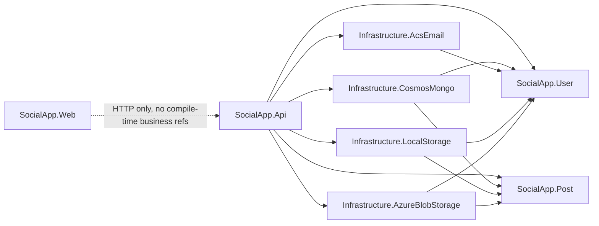
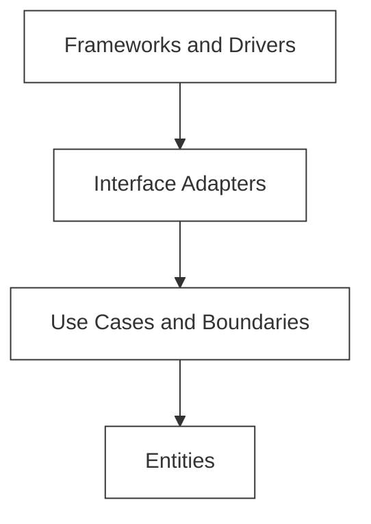
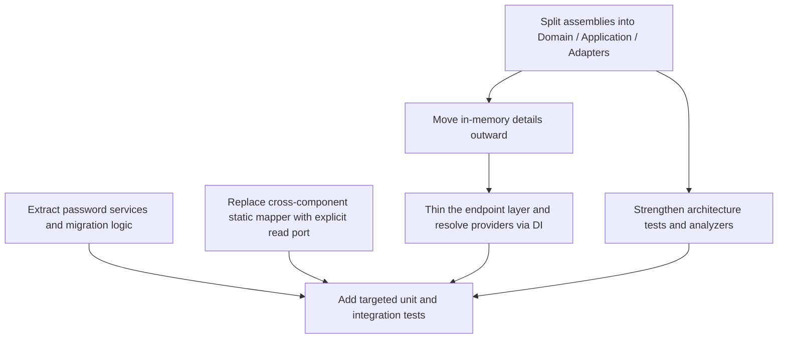

# Clean Architecture Analysis of jpeckham/clean-architecture-csharp

## Executive summary

This repository is a serious, well-structured **component-first** implementation of Clean Architecture ideas in C#. It clearly separates the two business components (`SocialApp.User` and `SocialApp.Post`) from outer details such as the API host, Blazor WebAssembly client, Cosmos/Mongo persistence, Azure Communication Services email, and file/blob media storage. The README explicitly states that the business components are intended to remain host-free and independent of ASP.NET, Blazor, MongoDB, Cosmos DB, and Terraform, and the architecture-test project codifies several of those rules. fileciteturn23file0 fileciteturn72file0

At the **project dependency** level, the repository is strong. `SocialApp.User` does not reference `SocialApp.Post`, `SocialApp.Post` does not reference `SocialApp.User`, `SocialApp.Web` does not reference business or infrastructure projects, and infrastructure projects point inward toward business-owned gateway interfaces. The repository also already contains architecture tests, component tests, and API slice tests, which is a major positive sign for long-term maintainability. fileciteturn72file0 fileciteturn68file0 fileciteturn69file0 fileciteturn70file0

Under a **strict** reading of Clean Architecture, however, the codebase is **not yet strict-clean**. The main reason is that several outer-ring concerns are still packaged inside the same assemblies as inner business rules: controllers, presenters, view models, and in-memory gateway implementations live inside `SocialApp.User` and `SocialApp.Post`; password hashing and migration behavior live inside a domain entity; a cross-component adapter in the API reaches into another component’s interactor helper; one presenter hard-codes an API route; and the main endpoint file performs transport handling, composition, auth extraction, exception-to-HTTP mapping, and upload-provider probing in one place. Those choices do not break the project graph, but they do weaken ring purity and make strict enforcement much harder. fileciteturn35file0 fileciteturn38file0 fileciteturn39file0 fileciteturn42file0 fileciteturn45file0 fileciteturn46file0 fileciteturn33file0 fileciteturn64file0 fileciteturn61file0

Robert C. Martin’s formulation is stricter than “folders look right”: source code dependencies should point inward; controllers and presenters belong in outer layers; and data crossing boundaries should be simple, isolated structures rather than outer-layer details leaking inward. Against that standard, this repository is **architecturally good, but not yet strict**. citeturn9view0turn9view1

The shortest path to strictness is to: move adapters and concrete in-memory details out of the business assemblies; extract password hashing out of entities; replace the cross-component `CreatePostInteractor.ToSummary` dependency with a dedicated read port; move route generation out of presenters; and strengthen the architecture tests so the build fails the moment those boundaries drift again. .NET’s built-in dependency injection, options pattern, analyzer infrastructure, `InternalsVisibleTo`, and ASP.NET Core testing stack are all sufficient to do that while staying heavily aligned with Microsoft technology. citeturn7view0turn10view0turn12view1turn11view0turn9view3

## Repository snapshot and dependency map

The solution and README show a repository organized around two business components plus outer adapters, infrastructure, and tests. The main source projects are `SocialApp.User`, `SocialApp.Post`, `SocialApp.Api`, `SocialApp.Web`, `SocialApp.Infrastructure.CosmosMongo`, `SocialApp.Infrastructure.AcsEmail`, `SocialApp.Infrastructure.LocalStorage`, and `SocialApp.Infrastructure.AzureBlobStorage`; the tests include dedicated component, infrastructure, API, and architecture test projects. fileciteturn6file0 fileciteturn23file0

| Project | Effective role today | Clean Architecture layer | Dependency direction |
|---|---|---|---|
| `SocialApp.User` | Entities, use cases, boundaries, controllers, presenters, view models, gateway interfaces, in-memory gateway implementations | Mixed inner + adapter + some concrete details | No business-component outward references fileciteturn35file0 fileciteturn36file0 fileciteturn37file0 fileciteturn38file0 fileciteturn39file0 |
| `SocialApp.Post` | Entities, use cases, boundaries, controllers, presenters, view models, gateway interfaces, in-memory gateway implementations | Mixed inner + adapter + some concrete details | No business-component outward references fileciteturn42file0 fileciteturn43file0 fileciteturn44file0 fileciteturn45file0 fileciteturn46file0 |
| `SocialApp.Api` | Minimal API host, endpoint adapters, composition root, cross-component adapter | Interface adapters + frameworks/drivers | Depends inward on business and outward on infrastructure registrations fileciteturn31file0 fileciteturn61file0 fileciteturn64file0 |
| `SocialApp.Web` | Blazor WASM UI, HTTP API client | Framework/UI outer ring | No compile-time reference to business or infrastructure fileciteturn32file0 fileciteturn65file0 fileciteturn72file0 |
| `SocialApp.Infrastructure.CosmosMongo` | Mongo/Cosmos gateway implementations, persistence documents, DI registration | Frameworks/drivers | Depends inward on User/Post gateway contracts and entities fileciteturn47file0 fileciteturn48file0 fileciteturn49file0 fileciteturn50file0 fileciteturn51file0 fileciteturn52file0 |
| `SocialApp.Infrastructure.AcsEmail` | ACS email adapter, DI registration | Frameworks/drivers | Depends inward on `IEmailGateway` fileciteturn53file0 fileciteturn54file0 |
| `SocialApp.Infrastructure.LocalStorage` | File-system media adapters | Frameworks/drivers | Depends inward on media gateway contracts fileciteturn55file0 fileciteturn56file0 fileciteturn57file0 |
| `SocialApp.Infrastructure.AzureBlobStorage` | Azure Blob media adapters | Frameworks/drivers | Depends inward on media gateway contracts fileciteturn58file0 fileciteturn59file0 fileciteturn60file0 |

The strongest current architectural fact is that the **business-component graph itself is clean and acyclic**. The architecture tests explicitly assert that `SocialApp.User` and `SocialApp.Post` do not reference each other, that business components do not reference outer details, and that `SocialApp.Web` has no business or infrastructure references. fileciteturn72file0



Package usage is also mostly where it should be: the repository’s own architecture tests forbid business-component references to ASP.NET Core, EF Core, Blazor, MongoDB, Azure Communication Services Email, and MediatR, and the source files show MongoDB, Azure Blob Storage, and ACS usage concentrated in outer infrastructure projects. That is exactly the right instinct. fileciteturn72file0 fileciteturn49file0 fileciteturn50file0 fileciteturn54file0 fileciteturn59file0 fileciteturn60file0

## Layer mapping against Clean Architecture

The repository’s current mapping is easiest to understand as a **component-first package layout with namespace-level rings** rather than true **assembly-level rings**. The User and Post projects each contain entities, request/response models, input/output boundaries, interactors, controllers, presenters, view models, gateway interfaces, and in-memory gateway implementations. The README explicitly says that each component owns all of those roles. That makes the architecture readable, but it also means the dependency rule is enforced mainly by convention and tests, not by assembly boundaries. fileciteturn23file0 fileciteturn35file0 fileciteturn36file0 fileciteturn37file0 fileciteturn38file0 fileciteturn39file0 fileciteturn42file0 fileciteturn43file0 fileciteturn44file0 fileciteturn45file0 fileciteturn46file0

| Clean Architecture layer | Current artifacts | Assessment |
|---|---|---|
| Entities | `UserAccount`, `ProfileImage`, `SocialPost`, `PostMediaItem` | Mostly correct, but `UserAccount` contains hashing logic and `SocialPost` reaches out to system time directly, which reduces strict purity. fileciteturn33file0 fileciteturn34file0 fileciteturn40file0 fileciteturn41file0 |
| Use Cases / Interactors | `*Interactor`, input/output boundaries, request/response models | Largely correct; interactors depend on ports and DTOs. The notable leak is that `CreatePostInteractor` exposes static summary-mapping helpers that are reused outside the use case. fileciteturn36file0 fileciteturn37file0 fileciteturn43file0 fileciteturn44file0 |
| Interface Adapters | Controllers, presenters, API endpoints, web client | Functionally present, but not strictly isolated because many adapter classes live inside the business assemblies. The API host also performs substantial orchestration directly. fileciteturn38file0 fileciteturn39file0 fileciteturn45file0 fileciteturn46file0 fileciteturn61file0 fileciteturn65file0 |
| Frameworks & Drivers | Mongo/Cosmos, ACS Email, file system, Azure Blob, ASP.NET host, Blazor host | Correctly outermost, with implementations depending inward on business contracts. fileciteturn31file0 fileciteturn32file0 fileciteturn47file0 fileciteturn53file0 fileciteturn55file0 fileciteturn58file0 |

This is the key distinction: the repository is clean in the **direction of project references**, but only partially clean in the **placement of ring responsibilities**. In Martin’s original formulation, controllers and presenters are outer-layer participants, and the dependency rule says source dependencies must point inward only. That rule becomes much easier to enforce when the rings are physically separate assemblies instead of just folders inside a component library. citeturn9view0turn9view1



**Current verdict:** the outer infrastructure projects are in the right place, but the inner business-component projects are carrying too many adapter and detail responsibilities to qualify as strict Clean Architecture.

## Violations and remedies

Martin’s dependency rule is blunt: source code dependencies should point inward, and inner circles should not know names from outer circles; boundary crossing should use simple DTO-style structures. Measured against that rule, I found the following gaps. citeturn9view0turn9view1

| Finding | Location | Why it breaks strictness | Severity | Exact remediation |
|---|---|---|---|---|
| Adapter roles are packaged inside business assemblies | `src/SocialApp.User/*` and `src/SocialApp.Post/*`; especially `Controllers`, `Presenters`, `ViewModels`, and public `InMemory*Gateway` classes. Approx. spans: `UserGateways.cs` ~ lines 43-338, `UserControllers.cs` ~ 1-58, `UserPresenters.cs` ~ 1-136, `PostGateways.cs` ~ 1-178, `PostControllers.cs` ~ 1-14, `PostPresenters.cs` ~ 1-106 | The code is readable, but the rings are only separated by namespace. That means controllers, presenters, and concrete gateway implementations are compiled into the same assemblies as business rules, so strict ring enforcement is impossible at assembly level. fileciteturn35file0 fileciteturn38file0 fileciteturn39file0 fileciteturn42file0 fileciteturn45file0 fileciteturn46file0 | High | Split each component into `Domain`, `Application`, and `Adapters` class libraries. Move `InMemory*Gateway` classes to `SocialApp.Infrastructure.InMemory` or to test-only projects. Keep only entities and use-case abstractions in the inner assemblies. Use `InternalsVisibleTo` instead of widening visibility just for tests. citeturn12view1turn9view0 |
| Password hashing and legacy migration logic live in an entity | `src/SocialApp.User/Entities/UserAccount.cs`, especially `Create`, `CheckPassword`, `ChangePassword`, `PasswordPolicy`, and `PasswordHasher`; approx. lines 21-152 | `UserAccount` depends on cryptographic implementation details, a concrete hash format, and a plaintext-migration fallback. Those are security and migration concerns, not pure enterprise policy. They also make algorithm changes more invasive. fileciteturn33file0 | High | Introduce `IPasswordService` and optionally `IPasswordPolicy` in the application layer. Let interactors hash/verify passwords and hand only opaque hashes to the entity. Put the PBKDF2 implementation in an infrastructure or security-adapter assembly. Keep the migration fallback out of the entity. citeturn7view0turn9view1 |
| A User-facing adapter reaches into a Post interactor helper | `src/SocialApp.Api/Endpoints/UserProfilePostGatewayAdapter.cs`, approx. lines 1-32 | The adapter imports `SocialApp.Post.UseCases` and calls `CreatePostInteractor.ToSummary`, then maps `PostSummaryResponse` into User-side summary records. That couples one component’s outer adapter to another component’s use-case implementation helper. fileciteturn64file0 | High | Replace the static interactor helper with a dedicated read port and DTO owned either by a new profile/read-model use case or by a dedicated Post read contract. The API adapter should depend on that contract, not on `CreatePostInteractor`. citeturn9view0turn9view1 |
| Presenter hard-codes an API route | `src/SocialApp.User/Presenters/UserPresenters.cs`, `UserPresenterMapping.ToProfileImageViewModel`, approx. lines  ninety-ish through the route-building block | The presenter emits `"/api/profile-images/{assetId}"`, which is HTTP route knowledge. That is an outer-framework concern leaking into a presenter that is already packaged inside a business assembly. fileciteturn39file0 | Medium | Have the presenter emit only `AssetId` and metadata. Build URLs in the API layer using ASP.NET Core route naming or `LinkGenerator`, or in the Web layer if the client owns the link format. citeturn9view1 |
| Endpoint file mixes transport, composition, auth, orchestration, and provider probing | `src/SocialApp.Api/Endpoints/SocialAppSliceEndpoints.cs`, throughout the file; especially the route handlers and `StoreMediaUpload`, roughly the middle-to-late part of the file | The file is serving as endpoint registry, controller, composition root, auth extractor, exception mapper, multipart parser, and upload-router. `StoreMediaUpload` probes one storage gateway and then another via exceptions, which is brittle and obscures intent. fileciteturn61file0 | Medium | Keep Minimal APIs if desired, but move handler logic into dedicated endpoint classes or thin application-facing services. Introduce a resolver such as `IMediaUploadGatewayResolver`, or use .NET keyed services to select the implementation cleanly from configuration. citeturn7view0turn10view0 |
| Architecture tests validate some rules but not strict ring separation | `tests/SocialApp.Architecture.Tests/ArchitectureRulesTests.cs`, approx. lines 8-97 | The tests verify many good rules, but they do not forbid `Controller`, `Presenter`, `ViewModel`, or `InMemory*Gateway` classes from residing in business assemblies. They therefore defend the current style, not strict ring purity. The feed-route test is also a UI behavior check, not an architectural rule. fileciteturn72file0 | Medium | After splitting assemblies, add tests that assert `Domain` has no dependencies on `Microsoft.*`, `MongoDB.*`, `Azure.*`, `System.Net.Http`, or `System.Text.Json`, and that `Application` contains no presenters/controllers/gateway implementations. Use NetArchTest plus analyzers to fail the build early. citeturn11view0turn12view2 |
| An abstraction is accepted, then downcast to a concrete type | `src/SocialApp.Post/Gateways/PostGateways.cs`, `InMemoryPostSearchGateway`, approx. lines 97-120 | `InMemoryPostSearchGateway` accepts `IPostGateway` and immediately casts it to `InMemoryPostGateway`. That is a direct abstraction leak and creates runtime fragility if any other implementation is passed. fileciteturn42file0 | Medium | Either inject `InMemoryPostGateway` directly into this in-memory-only adapter, or create an internal read-store interface implemented only by the in-memory store. This belongs in an outer in-memory adapter assembly, not the core Post assembly. |

**Project and namespace refactor recommendation**

The strictest and cleanest C#-first refactor is:

```text
src/
  SocialApp.User.Domain/
  SocialApp.User.Application/
  SocialApp.User.Adapters/
  SocialApp.Post.Domain/
  SocialApp.Post.Application/
  SocialApp.Post.Adapters/
  SocialApp.Infrastructure.CosmosMongo/
  SocialApp.Infrastructure.AcsEmail/
  SocialApp.Infrastructure.LocalStorage/
  SocialApp.Infrastructure.AzureBlobStorage/
  SocialApp.Infrastructure.InMemory/
  SocialApp.Api/
  SocialApp.Web/
```

That lets you express the dependency rule with project references rather than only naming conventions. It also lets architecture tests verify the ring graph mechanically instead of inferring it from namespaces. That is much closer to the original Clean Architecture intent. citeturn9view0turn9view1

**Before/after: password handling**

```csharp
// Before: entity owns hashing and verification
public static UserAccount Create(string displayName, string handle, string email, string password)
{
    PasswordPolicy.Validate(password);
    return new UserAccount(Guid.NewGuid(), displayName.Trim(), handle.Trim(), email.Trim(), PasswordHasher.Hash(password), null);
}
```

```csharp
// After: application owns hashing, entity stores an opaque hash
public interface IPasswordService
{
    void Validate(string password);
    string Hash(string password);
    bool Verify(string password, string passwordHash);
}

public sealed class RegisterAccountInteractor(
    IUserGateway users,
    IPendingRegistrationGateway registrations,
    IVerificationCodeGateway codes,
    IEmailGateway email,
    IPasswordService passwords,
    IRegisterAccountOutputBoundary output) : IRegisterAccountInputBoundary
{
    public void Handle(RegisterAccountRequest request)
    {
        passwords.Validate(request.Password);

        if (users.FindByHandle(request.Handle) is not null ||
            users.FindByEmail(request.Email) is not null)
        {
            output.Present(new RegisterAccountResponse(false, UserMessageKeys.AccountAlreadyExists));
            return;
        }

        var passwordHash = passwords.Hash(request.Password);

        registrations.Save(new PendingRegistration(
            request.DisplayName.Trim(),
            request.Handle.Trim(),
            request.Email.Trim(),
            passwordHash));

        var code = codes.CreateCode(request.Email, "registration", TimeSpan.FromMinutes(15));
        email.Send(request.Email, "Verify your SocialApp account", $"Your verification code is {code}.");
        output.Present(new RegisterAccountResponse(true, UserMessageKeys.VerificationCodeSent));
    }
}
```

This keeps the entity focused on business state and invariants while the application layer coordinates security services through abstractions. That follows the dependency-injection guidance from Microsoft and removes a concrete technical dependency from the entity. citeturn7view0

**Before/after: cross-component profile-post mapping**

```csharp
// Before: API adapter reaches into another component's interactor helper
public sealed class UserProfilePostGatewayAdapter(IPostGateway posts) : IUserProfilePostGateway
{
    public IReadOnlyList<UserProfilePostSummary> RecentPostsByAuthor(string authorHandle, string readerHandle, int limit) =>
        posts.RecentByAuthor(authorHandle, Math.Clamp(limit, 1, 100))
             .Select(post => CreatePostInteractor.ToSummary(post, posts, readerHandle))
             .Select(ToUserProfilePost)
             .ToArray();
}
```

```csharp
// After: use a dedicated read contract
public sealed record ProfilePostReadModel(
    Guid Id,
    string AuthorHandle,
    string Content,
    Guid? ParentPostId,
    Guid? OriginalPostId,
    DateTimeOffset CreatedAt,
    int LikeCount,
    bool LikedByCurrentReader,
    int RepostCount,
    bool RepostedByCurrentReader);

public interface IProfilePostReadGateway
{
    IReadOnlyList<ProfilePostReadModel> RecentByAuthor(string authorHandle, string readerHandle, int limit);
}

public sealed class PostProfileReadGateway(IPostGateway posts) : IProfilePostReadGateway
{
    public IReadOnlyList<ProfilePostReadModel> RecentByAuthor(string authorHandle, string readerHandle, int limit) =>
        posts.RecentByAuthor(authorHandle, limit)
             .Select(post => new ProfilePostReadModel(
                 post.Id,
                 post.AuthorHandle,
                 post.Content,
                 post.ParentPostId,
                 post.OriginalPostId,
                 post.CreatedAt,
                 post.LikedBy.Count,
                 post.LikedBy.Contains(readerHandle),
                 posts.CountActiveReposts(post.OriginalPostId ?? post.Id),
                 posts.FindActiveRepost(post.OriginalPostId ?? post.Id, readerHandle) is not null))
             .ToArray();
}
```

That change removes the dependency on another use case’s helper method and turns the read model into an explicit port rather than an accidental reuse of an interactor utility. fileciteturn64file0

**Before/after: provider selection with Microsoft DI rather than branching and probing**

```csharp
// After: keyed services for provider selection
builder.Services.AddKeyedSingleton<IProfileImageStorageGateway, FileSystemProfileImageStorageGateway>("filesystem");
builder.Services.AddKeyedSingleton<IProfileImageStorageGateway, AzureBlobProfileImageStorageGateway>("azureblob");

builder.Services.AddSingleton<IProfileImageStorageGateway>(sp =>
{
    var provider = sp.GetRequiredService<IOptions<MediaOptions>>().Value.Provider?.ToLowerInvariant() ?? "filesystem";
    return sp.GetRequiredKeyedService<IProfileImageStorageGateway>(provider);
});
```

.NET now supports keyed DI registrations, which is a good fit for media-provider selection and removes the need for long `if/else` chains or exception-based probing. The options pattern is also the right Microsoft-native way to isolate provider configuration by scenario. citeturn7view0turn10view0turn10view1

## Prioritized remediation plan

The plan below assumes you want **strict adherence** while preserving the repository’s strengths: small business components, no shared dumping-ground project, and heavy use of C#/.NET/Microsoft infrastructure.

| Priority | Task | Estimated effort | Risk | Expected payoff |
|---|---|---:|---|---|
| P1 | Split `SocialApp.User` and `SocialApp.Post` into `Domain`, `Application`, and `Adapters`; move `InMemory*Gateway` classes to `Infrastructure.InMemory` or test projects | 12–20 hours | Medium | Makes ring boundaries enforceable at compile time |
| P1 | Extract password hashing and plaintext-migration logic from `UserAccount` into `IPasswordService` and an outer implementation | 8–14 hours | Medium-High | Cleans entity boundary and hardens auth design |
| P1 | Replace `UserProfilePostGatewayAdapter`’s dependency on `CreatePostInteractor.ToSummary` with a dedicated read port and DTOs | 6–10 hours | Medium | Removes cross-component use-case coupling |
| P2 | Move route generation out of presenters and into API/web adapters; name the image endpoint and generate URLs there | 2–4 hours | Low | Removes HTTP leakage from component presenter code |
| P2 | Break `SocialAppSliceEndpoints` into thin endpoint handlers plus dedicated services for auth extraction and upload resolution | 6–12 hours | Low-Medium | Simplifies transport layer and improves testability |
| P2 | Fix `InMemoryPostSearchGateway` so it no longer accepts an abstraction and then downcasts it | 1–2 hours | Low | Removes a concrete DIP violation |
| P3 | Strengthen architecture tests and analyzer settings; fail builds on boundary drift | 4–8 hours | Low | Prevents regression |
| P3 | Add focused unit/integration tests around refactored auth, profile projection, and media resolution | 4–8 hours | Low | Locks in the improved structure |



If you do only three things, do these first: **physical assembly separation**, **password-service extraction**, and **cross-component read-port cleanup**. Those three changes deliver the largest jump from “good component architecture” to “strict Clean Architecture.”

## Automated enforcement and tests

The repository already has a solid starting point: `SocialApp.Architecture.Tests` uses `NetArchTest.Rules`, the API tests use `WebApplicationFactory<Program>`, and the component tests exercise controller → interactor → gateway → presenter flows. That foundation is worth keeping. fileciteturn72file0 fileciteturn70file0 fileciteturn68file0 fileciteturn69file0

For analyzers, stay Microsoft-first. .NET’s SDK already includes Roslyn analyzers, code analysis is enabled by default for .NET 5+ targets, analysis mode can be raised to `Recommended` or `All`, and rule severities can be configured centrally through MSBuild and `.editorconfig`. That is exactly the right baseline for this repository. citeturn11view0turn12view2

Suggested MSBuild settings:

```xml
<PropertyGroup>
  <TreatWarningsAsErrors>true</TreatWarningsAsErrors>
  <AnalysisMode>Recommended</AnalysisMode>
  <EnforceCodeStyleInBuild>true</EnforceCodeStyleInBuild>
</PropertyGroup>
```

Suggested `.editorconfig` additions:

```ini
[*.cs]
dotnet_analyzer_diagnostic.category-Design.severity = warning
dotnet_analyzer_diagnostic.category-Reliability.severity = warning
dotnet_analyzer_diagnostic.category-Security.severity = warning

dotnet_diagnostic.CA2000.severity = warning
dotnet_diagnostic.CA2016.severity = warning
dotnet_diagnostic.CA2200.severity = warning
dotnet_diagnostic.CA2201.severity = warning
dotnet_diagnostic.IDE0040.severity = warning
```

Suggested architecture tests after the split:

```csharp
using FluentAssertions;
using NetArchTest.Rules;
using Xunit;

public sealed class StrictArchitectureTests
{
    [Fact]
    public void Domain_should_not_depend_on_frameworks_or_adapters()
    {
        var result = Types.InAssembly(typeof(SocialApp.User.Domain.UserAccount).Assembly)
            .That().ResideInNamespace("SocialApp.User.Domain")
            .ShouldNot().HaveDependencyOnAny(
                "Microsoft.AspNetCore",
                "Microsoft.Extensions",
                "MongoDB.Driver",
                "Azure.",
                "System.Net.Http",
                "System.Text.Json",
                "SocialApp.User.Adapters",
                "SocialApp.Infrastructure")
            .GetResult();

        result.IsSuccessful.Should().BeTrue();
    }

    [Fact]
    public void Application_should_not_contain_controllers_presenters_or_concrete_gateways()
    {
        var result = Types.InAssembly(typeof(SocialApp.User.Application.CreateAccountInteractor).Assembly)
            .That().ResideInNamespace("SocialApp.User.Application")
            .ShouldNot().HaveNameEndingWith("Controller")
            .AndShouldNot().HaveNameEndingWith("Presenter")
            .AndShouldNot().HaveNameContaining("InMemory")
            .GetResult();

        result.IsSuccessful.Should().BeTrue();
    }
}
```

For integration tests, keep using `Microsoft.AspNetCore.Mvc.Testing`. Microsoft’s guidance is explicit: `WebApplicationFactory<TEntryPoint>` is the standard way to bootstrap the SUT and customize services for integration tests. The repository already follows that pattern in `SocialAppApiSliceTests`, so the recommendation is to expand, not replace, it. citeturn9view3 fileciteturn70file0

Sample integration test to preserve the refactored boundary:

```csharp
using System.Net;
using FluentAssertions;
using Microsoft.AspNetCore.Mvc.Testing;
using Microsoft.Extensions.DependencyInjection;
using Microsoft.Extensions.DependencyInjection.Extensions;
using Xunit;

public sealed class ProfileEndpointTests : IClassFixture<WebApplicationFactory<Program>>
{
    private readonly WebApplicationFactory<Program> _factory;

    public ProfileEndpointTests(WebApplicationFactory<Program> factory)
    {
        _factory = factory.WithWebHostBuilder(builder =>
            builder.ConfigureServices(services =>
            {
                services.RemoveAll<IProfilePostReadGateway>();
                services.AddSingleton<IProfilePostReadGateway, StubProfilePostReadGateway>();
            }));
    }

    [Fact]
    public async Task Get_user_requires_authentication()
    {
        var client = _factory.CreateClient();

        var response = await client.GetAsync("/api/users/%40ada");

        response.StatusCode.Should().Be(HttpStatusCode.Unauthorized);
    }

    private sealed class StubProfilePostReadGateway : IProfilePostReadGateway
    {
        public IReadOnlyList<ProfilePostReadModel> RecentByAuthor(string authorHandle, string readerHandle, int limit) =>
            Array.Empty<ProfilePostReadModel>();
    }
}
```

A GitHub Actions workflow should then run the same local build/test commands the official GitHub documentation recommends for .NET, and it should always upload TRX results so architecture-test failures and integration-test failures are visible immediately in pull requests. citeturn9view4

```yaml
name: ci

on:
  push:
    branches: [ main ]
  pull_request:

jobs:
  build-test:
    runs-on: ubuntu-latest

    steps:
      - uses: actions/checkout@v6

      - name: Setup .NET
        uses: actions/setup-dotnet@v4
        with:
          dotnet-version: '9.0.x'   # Adjust if the repo target framework changes

      - name: Restore
        run: dotnet restore SocialApp.sln

      - name: Build
        run: dotnet build SocialApp.sln --no-restore -warnaserror

      - name: Test
        run: dotnet test SocialApp.sln --no-build --logger trx --results-directory TestResults

      - name: Upload test results
        if: ${{ always() }}
        uses: actions/upload-artifact@v4
        with:
          name: test-results
          path: TestResults
```

If you want one more enforcement layer, add a tiny in-house Roslyn analyzer project later to ban `DateTimeOffset.UtcNow` in domain/application assemblies and to ban route literals or `System.Text.Json` usage in those assemblies. That keeps enforcement in Microsoft tooling rather than relying only on conventions.

## References and limitations

The architectural standard used in this review is Robert C. Martin’s Clean Architecture: dependencies point inward; controllers and presenters sit outside use cases; and boundary-crossing data should be simple and isolated. citeturn9view0turn9view1

For Microsoft-aligned remediation, the most relevant primary references are .NET dependency injection, the options pattern, built-in source-code analysis, `InternalsVisibleTo` friend assemblies, ASP.NET Core integration testing with `WebApplicationFactory`, GitHub’s official .NET build/test workflow guidance, and EF Core’s guidance on `DbContext` lifetime and testing if you ever replace Mongo/Cosmos with a Microsoft-first relational stack. citeturn7view0turn10view0turn10view1turn11view0turn12view2turn12view1turn9view3turn9view4turn13view0turn13view1

This analysis is based on **connector-backed static inspection** of the selected repository’s solution, project files, source files, and tests. I did not rely on any other application repository when assessing your code. One practical limitation is that the connector returns whole-file blobs rather than native numbered source lines, so the line ranges I gave above are best-effort approximations anchored to specific files and methods. Another limitation is CI discovery: I did not retrieve a workflow file from the repository material examined here, so CI should be treated as **unspecified** rather than definitively absent.

**Bottom line:** keep the component-first spirit, but move from **namespace-separated rings** to **assembly-enforced rings**. Once you do that, this repository can become not just a good Clean Architecture reference, but a strict one.